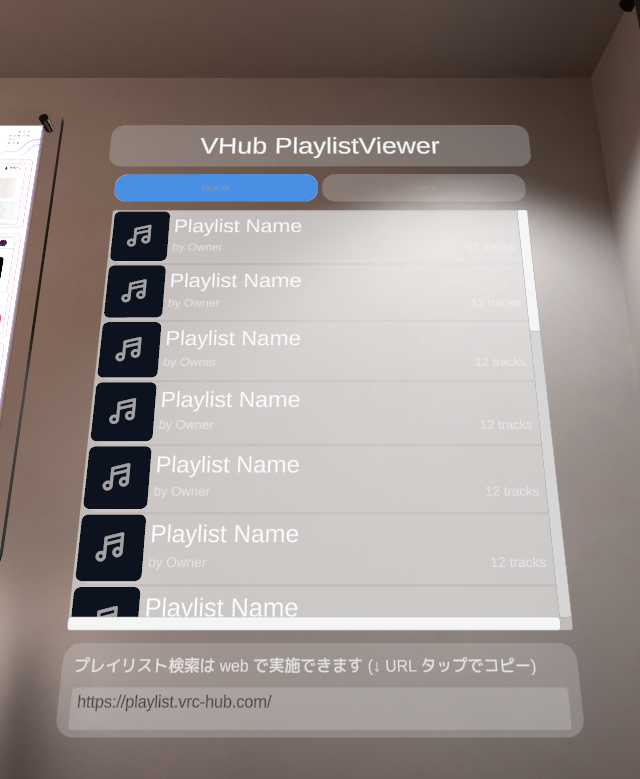
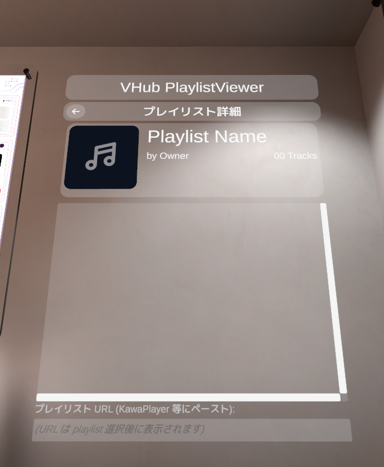
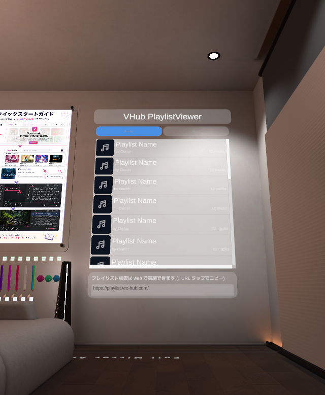

# VHub PlaylistViewer

**VRChat ワールド内で [VHub PlayList](https://playlist.vrc-hub.com) のプレイリストを browse して、URL を [KawaPlayer](https://github.com/Mega-Gorilla/KawaPlayer) などの動画プレイヤーに渡す View 専用 unitypackage。**

## 概要

ワールド入室直後に Popular プレイリストを自動 fetch、Recent タブで最近作成されたプレイリストを browse、行をタップして DetailView でカバー画像 + トラック一覧 + URL を表示。URL は VRChat 内蔵キーボードで Copy → KawaPlayer 等の **任意の VRCUrl 受け取り型動画プレイヤー** に Paste して再生。

free-form 検索は **Web ブラウザに誘導** (`https://playlist.vrc-hub.com/`、SearchView footer の URL field で 1 クリック copy)。in-VRChat free-form search は VRChat Udon API 制約 (`VRCUrl` runtime 構築不可、`VRCUrlInputField.text` setter 非公開等) により UX 改善困難と判断し、PR #38 で廃止 (詳細 `docs/unity-architecture.md` §4.2)。

## 機能

- **Popular / Recent タブ** — 入室時 auto-load + タブ切替で最大 50 ページのページング
- **DetailView** — カバー画像 (`i.ytimg.com` 直接 URL 経由) + プレイリスト名 + 所有者 + トラック一覧 + コピー用 URL field
- **Web 検索誘導 footer** — `https://playlist.vrc-hub.com/` を 1 クリック copy、ブラウザで検索 → URL コピーで詳細表示
- **Loading / Error overlay** — 自動 fade transition、エラー後 5 秒で SearchView 自動復帰
- **Theme color system** — Inspector で 7 色 SerializeField (primary / surface / hover / overlay / text primary/muted / error) を一括カスタマイズ
- **Pre-allocated 20 ResultRow** — 動的 Instantiate なし (Udon パフォーマンス考慮)
- **Apache License 2.0** — 派生再配布可、`NOTICE` 配布チェーン要件あり (詳細下記)

## スクリーンショット

| SearchView レイアウト (placeholder rows) | DetailView レイアウト (playlist 未選択時の placeholder state) |
|---|---|
|  |  |

> **Note**: 上記 2 枚はいずれも **placeholder 状態** (実 server fetch 前の Pre-allocated rows / playlist 未選択時の DetailView template)。実データ load 後は ResultRow に実 playlist 名 + 所有者 + cover thumbnail が、DetailView に選択 playlist の cover art + tracks 一覧 + URL が表示されます。実データ入りの screenshot 差し替えは follow-up 予定。

ワールド設置例 (testing-chamber、室内ボード型 Canvas):

## 動作環境

| 項目 | 必要バージョン |
|---|---|
| Unity | **2022.3.x** (VRChat World SDK 推奨バージョン) |
| VRChat World SDK | **>= 3.8.1** (`com.vrchat.worlds`) |
| VCC (Creator Companion) | 推奨 (VPM 経由 install) |
| TextMeshPro Essentials | 必須 (Unity 標準同梱、未 import の場合 `Window > TextMeshPro > Import TMP Essential Resources`) |

## インストール

3 つの方法から選択。**VCC 経由を推奨**。

### 方法 A: VCC 経由 (推奨)

1. [VCC (Creator Companion)](https://vcc.docs.vrchat.com/) を開く
2. **Settings > Packages > Add Repository** で `https://mega-gorilla.github.io/vpm-repos/index.json` を追加 ([KawaPlayer](https://github.com/Mega-Gorilla/KawaPlayer) を導入済の場合は既登録)
3. Project の **Manage Project > Manage Packages** で `VHub PlaylistViewer` を検索 → **+** で追加

### 方法 B: GitHub Release `.zip` 手動 install

1. [Releases](https://github.com/Mega-Gorilla/VhubPlaylistViewer/releases) から **`com.vhub.kawaplayer-playlistviewer-{version}.zip`** をダウンロード
2. Unity Project の `Packages/com.vhub.kawaplayer-playlistviewer/` に解凍 (`package.json` が直下に来る形)
3. Unity Editor で自動 import + UdonSharp 自動 recompile

### 方法 C: `.unitypackage` 経由

非 VCC ユーザー向け。Unity の `Assets > Import Package > Custom Package` から install。

1. [Releases](https://github.com/Mega-Gorilla/VhubPlaylistViewer/releases) から **`com.vhub.kawaplayer-playlistviewer-{version}.unitypackage`** をダウンロード
2. Unity Editor で **`Assets > Import Package > Custom Package`** → ダウンロードした `.unitypackage` を選択 → import
3. Files 配置先: `Packages/com.vhub.kawaplayer-playlistviewer/...` (VPM 同等の path、Unity 2022.3+ で自動 package 認識)
4. UdonSharp 自動 recompile

**注意**: 方法 A/B/C は **mutually exclusive** (どれか 1 つだけ選択)。複数同時 install は GUID 重複で Unity が error を出します。

## セットアップ (5 step)

### (1) Allowed Domains に `playlist.vrc-hub.com` を追加

VRChat World 上では allowed list に登録した domain にしか HTTP request できません。

**Editor 内設定**: `Tools > VHub PlaylistViewer > Allowed Domains Helper` を開いて表示される手順に従う (vrchat.com の World 設定ページへの link あり)。

**外部設定 (本番反映)**: [vrchat.com/home/content/worlds](https://vrchat.com/home/content/worlds) で対象 world の Allowed Domains に `playlist.vrc-hub.com` を追加。

### (2) Prefab を Hierarchy に drag

`Packages/com.vhub.kawaplayer-playlistviewer/Runtime/Prefabs/PlaylistViewer.prefab` を Hierarchy ウィンドウに drag-and-drop。

### (3) Reposition + scale 調整 (任意)

prefab の root transform は **neutral** (`position=(0,0,0) / rotation=identity / scale=(1,1,1)`)。所望の場所に Position / Rotation / Scale を Inspector で調整。

参考: testing-chamber sample placement は `position=(3.94, 1.86, -1.66)` / `rotation=(0°, 90°, 0°)` / `scale=(1.30, 1.30, 1.30)` (室内壁面ボード)。

### (4) Pool 生成 (`Tools > VHub PlaylistViewer > Generate Pools`)

VRChat の Udon 制約 (`VRCUrl` を runtime で構築不可) により、必要な URL は事前に Editor で `VRCUrl[]` として bake しておく必要があります。

1. メニュー `Tools > VHub PlaylistViewer > Generate Pools` を開く
2. 自動的に `Controller` / `ListingClient` / `PlaylistResolver` / `ThumbnailLoader` が resolve される (Hierarchy で PlaylistViewer を選択しておくと auto-fill)
3. **Base URL** は `https://playlist.vrc-hub.com` (デフォルト、staging/dev 切替時のみ変更)
4. **Generate** ボタンを押下 → status に `Generated: resolve=1024, yt-thumb-direct=N, popular pages=50, recent pages=50, news=1` 表示で完了
5. Scene save

### (5) ワールドを upload

通常通り VRChat World SDK の `Build & Publish` でアップロード。

## 使い方

### A. ワールド内ブラウズ workflow

1. ワールドに入室 → 2 秒後に **Popular** が自動 load
2. **Popular / Recent** タブで browse
3. 結果カードをタップ → **DetailView** に遷移、カバー画像 + プレイリスト名 + 所有者 + トラック一覧表示
4. DetailView 下部の **`#UrlField`** をタップ → VRChat キーボード起動、URL がプリセット表示
5. キーボードの **Copy** で URL コピー
6. KawaPlayer または任意の VRCUrl 受け取り型動画プレイヤーの **InputField に Paste** → 再生

### B. Web 検索 workflow (free-form search が必要な場合)

1. SearchView footer の **`#WebSearchUrlField`** (`https://playlist.vrc-hub.com/`) をタップ
2. VRChat キーボードで URL を **Copy**
3. ブラウザで `https://playlist.vrc-hub.com/` を開いて検索
4. 見つけたプレイリストの URL をブラウザで Copy
5. ワールドに戻り、KawaPlayer 等に Paste して再生 (workflow A の step 6 と同じ)

## カスタマイズ

### Theme color (7 色)

PlaylistViewer の **`Controller`** を選択 → Inspector の `Theme (#23 §0)` セクションで以下を変更可:

| field | デフォルト | 用途 |
|---|---|---|
| `Primary Color` | `#4A90E2` | 選択中タブ / アクションボタン色 |
| `Surface Color` | `white α=0.08` | カード / 非選択タブ背景 |
| `Surface Hover Color` | `white α=0.16` | ResultRow hover |
| `Overlay Color` | `dark navy α=0.85` | Loading / Error overlay BG |
| `Text Primary Color` | white | 主要 text |
| `Text Muted Color` | `white α=0.6` | 補助 text |
| `Error Color` | `#E55353` | エラー表示 |

### Tab visibility

- **News tab を表示**: `Hierarchy` で `Canvas/#SearchView/#TabRow/#TabNews` を選択 → Inspector で `SetActive(true)`。HorizontalLayoutGroup が Popular/Recent/News を 33% 等幅に再分配
- **個別 Tab 削除**: `#TabPopular` 等を `SetActive(false)` で非表示化、HLG が残りを再分配

### Pool 再生成 (staging/dev URL 切替)

`Tools > VHub PlaylistViewer > Generate Pools` で **Base URL** を変更 → **Generate** で全 5 pool を新 URL から bake し直し (resolve / yt-thumb-direct / popular / recent / news)。

## アーキテクチャ概要

詳細: [`docs/unity-architecture.md`](docs/unity-architecture.md)

- **4 段レイアウト** (canvas 768×1024、均一 16px gap): `#Header` / `#TabRow` / Scroll View / `#SearchBar` (footer)
- **Pre-allocated 20 ResultRow** (`#ResultRow0..#ResultRow19`、Pre-allocated で動的 Instantiate なし)
- **BindHierarchy 自動配線** — `#`-prefix 名前一致で Controller が child を自動 wire
- **5 つの VRCUrl pool** — resolve / yt-thumb-direct / popular pages / recent pages / news (PoolGenerator で baseUrl から bake)
- **Search 機能廃止** (#38) — VRChat Udon API 制約により Web 誘導 UI に置換、§4.2 参照

## ライセンス

**Apache License 2.0** ([LICENSE.md](LICENSE.md))

### 派生再配布時の義務 (Apache 2.0 §4)

本パッケージを改変・再配布する場合:

1. **§4(a)** — `LICENSE.md` のコピーを再配布物に含める
2. **§4(b)** — 改変したファイルに「changed」を明示する notice を付ける
3. **§4(c)** — Source 形式の派生で copyright / patent / trademark / attribution notices を保持
4. **§4(d)** — **本パッケージの [`NOTICE`](NOTICE) ファイルの内容を verbatim で再配布物に含める** (内容変更不可、自分の attribution は addendum 可)

### 同梱 third-party

- **Phosphor Icons (MIT)** — `Runtime/Sprites/UI_*.png` の派生元 (bold-weight SVG を `resvg-py` で 4× supersampling rasterize)。`NOTICE` + [`THIRD_PARTY_NOTICES.md`](THIRD_PARTY_NOTICES.md) で attribution 記載

### 依存 (unbundled、API 利用のみ、本パッケージに含まれない)

- **UdonSharp (MIT)** — VRChat World SDK 経由
- **Newtonsoft.Json (MIT)** — Unity 同梱 (`com.unity.nuget.newtonsoft-json`)、Editor-only
- **VRChat Worlds SDK** — VRChat Creator EULA、unbundled

詳細は [`THIRD_PARTY_NOTICES.md`](THIRD_PARTY_NOTICES.md) 参照。

## 関連プロジェクト

- **[VHub PlayList](https://playlist.vrc-hub.com/)** — プレイリスト管理 web frontend
- **[KawaPlayer](https://github.com/Mega-Gorilla/KawaPlayer)** — VRChat 向け動画プレイヤー (YamaPlayer ベース)、本パッケージで copy した URL を paste して再生
- **[Phosphor Icons](https://phosphoricons.com/)** — UI sprite の派生元 (MIT)

## 開発状況

| 完了 | 内容 |
|---|---|
| #23 | Phase A 全完了 (modern UI、theme system、prefab compatibility) |
| #38 | Search 廃止 + Web 誘導 UI + 4 段 layout 整列 |
| #12 | `Runtime/Prefabs/PlaylistViewer.prefab` export |
| #15 | Apache License 2.0 + NOTICE + THIRD_PARTY_NOTICES.md |
| **#14** | **完成版 README (本ファイル)** |

| 残課題 | 内容 |
|---|---|
| #13 | Animator (`PlaylistViewer.controller`) — α fade transitions、Button press scale 等の演出層 |
| #17 | VPM listing 登録 (`vpm-repos` への entry 追加 + GitHub Release zip 配布) |

詳細は [Issues](https://github.com/Mega-Gorilla/VhubPlaylistViewer/issues) 参照。
