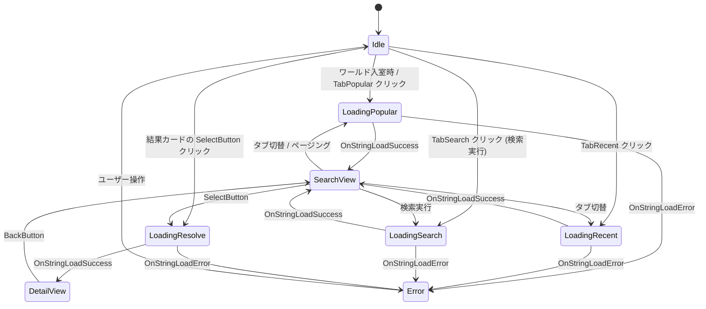

# KawaPlayer PlaylistViewer — Unity 側アーキテクチャ

> **対象**: 本リポジトリの Unity / UdonSharp 実装。
> **前提**: サーバー側仕様は [`server-api-spec.md`](./server-api-spec.md) を参照。
> **作成日**: 2026-04-27

## 0. 全体像

VRChat ワールドに 1 つ配置するだけで、ボード型 UI が表示され:
- VHub PlayList のプレイリストを **検索 / 人気 / 最近** で閲覧できる
- 詳細画面で **トラック一覧 + KawaPlayer 等に貼り付け用の URL** を表示

外部の動画プレイヤー (KawaPlayer 等) には **直接連携しない**。ユーザーが VRChat キーボードの Copy/Paste で手動で URL を渡す運用。

## 1. パッケージレイアウト

KawaPlayer (`com.vhub.kawaplayer`) と同じ慣習で、**リポジトリ直下を VPM パッケージ化**する。

```
KawaPlayer_PlaylistViewer/                    ← repo root = package root
├── package.json                                  VPM パッケージマニフェスト
├── README.md
├── LICENSE.md                                    (TBD, issue #15)
├── CHANGELOG.md
├── Runtime/
│   ├── MegaGorilla.KawaPlayer.PlaylistViewer.Runtime.asmdef
│   ├── Scripts/
│   │   ├── PlaylistViewerController.cs           メイン状態機械
│   │   ├── ListingClient.cs                      popular/recent クライアント
│   │   ├── SearchClient.cs                       search クライアント (VRCUrlInputField 経由)
│   │   ├── PlaylistResolver.cs                   /r/... resolve クライアント
│   │   ├── ThumbnailLoader.cs                    VRCImageDownloader プール
│   │   ├── Keypad3D.cs                           3D キーパッド (親)
│   │   └── KeypadKey.cs                          3D キーパッドの個別キー
│   ├── Prefabs/
│   │   └── PlaylistViewer.prefab                 (issue #12, Unity Editor 必須)
│   ├── Animations/
│   │   ├── PlaylistViewer.controller             (issue #13)
│   │   ├── ShowSearch.anim
│   │   └── ShowDetail.anim
│   └── Materials/                                (Unity Editor 必須)
├── Editor/
│   ├── MegaGorilla.KawaPlayer.PlaylistViewer.Editor.asmdef
│   └── Scripts/
│       ├── PoolGenerator.cs                      4 種 VRCUrl[] のベイク
│       ├── PoolGeneratorWindow.cs                Tools メニュー
│       └── AllowedDomainsHelper.cs               CustomEditor で導入手順表示
├── Documentation~/                               VPM の規約上 Unity が無視する
│   └── installation.md
├── docs/                                         開発者向け (本文)
│   ├── server-api-spec.md
│   └── unity-architecture.md (this)
└── _references/                                  (.gitignore 対象、参考実装の物理コピー)
```

## 2. 命名規約

### 2.1 アセンブリ / 名前空間

| asmdef | C# Namespace |
|---|---|
| `MegaGorilla.KawaPlayer.PlaylistViewer.Runtime` | `MegaGorilla.KawaPlayer.PlaylistViewer` |
| `MegaGorilla.KawaPlayer.PlaylistViewer.Editor` | `MegaGorilla.KawaPlayer.PlaylistViewer.Editor` |

### 2.2 Hierarchy 命名規約 (VIB 流儀)

prefab 内の子 GameObject 名で、用途を区別する:

| プレフィックス | 意味 |
|---|---|
| `#XXX` | スクリプトが (Start() でバインド or per-row 描画時に) アクセスする要素。読み取り / 書き込み問わず |
| `*XXX` | デザイナーが自由に編集できる装飾要素。スクリプトは触らない |
| (なし) | グルーピング用の中間オブジェクト。スクリプトの関心外 |

**重要: `BindHierarchy()` は `GetComponentsInChildren<Transform>(true)` で**インアクティブな子も含めて深さ優先で全走査**するため、テンプレート (例: `#ResultTemplate`, `#TrackTemplate`) の中にも同名の `#XXX` があると先に hit して上書きされる。これを避けるためトップレベル binding 名はテンプレート内 binding 名と被らせない:

| トップレベル (1 個だけ存在) | テンプレート内 (per-row, 複数 clone) |
|---|---|
| `#PlaylistName` (詳細ビュー) | `#Name` (検索結果カード) |
| `#OwnerName` (詳細ビュー) | `#Owner` (検索結果カード) |
| `#TotalTracks` (詳細ビュー、playlist 総トラック数) | `#TrackCount` (検索結果カード、playlist の trackCount) |

**主要な `#`-prefix 要素一覧** (実装の `Start()` で参照される):

```
PlaylistViewer (PlaylistViewerController)
└── Canvas
    ├── #SearchView
    │   ├── #SearchInputField        (VRCUrlInputField, Inspector で text に API URL プレフィックスをプリセット)
    │   ├── #TabPopular              (Button)
    │   ├── #TabRecent               (Button)
    │   ├── #TabSearch               (Button, クエリ送信)
    │   ├── #ResultListContent       (ScrollRect Content, 親)
    │   │   └── #ResultTemplate      (非アクティブのテンプレート row)
    │   │       ├── #Thumbnail       (RawImage)
    │   │       ├── #Name            (TMP_Text)
    │   │       ├── #Owner           (TMP_Text)
    │   │       ├── #TrackCount      (TMP_Text)
    │   │       └── #SelectButton    (Button)
    │   ├── #PrevPageBtn / #NextPageBtn / #PageLabel
    │   ├── #LoadingOverlay
    │   └── #ErrorOverlay
    │       └── #ErrorMessage        (TMP_Text)
    └── #DetailView
        ├── #PlaylistName / #OwnerName / #TotalTracks
        ├── #UrlField                (TMP_InputField, readOnly)
        ├── #TrackListContent
        │   └── #TrackTemplate
        │       ├── #Position
        │       └── #Title
        └── #BackButton
```

**v1 では検索入力に 3D キーパッドを使わない**: `Keypad3D` / `KeypadKey` は repo に同梱されているが汎用 TMP_InputField 用ユーティリティとしての位置付けで、v1 prefab には含めない。理由は §12 を参照。

## 3. 状態機械

`PlaylistViewerController` が保持する状態:



## 4. データフロー

### 4.1 popular/recent (人気/最近) ロード

```
[Tab Popular Click]
  → controller.RequestPopular(0)
    → listingClient.LoadPopular(0)
      → _popularPagePool[0] (baked VRCUrl) を VRCStringDownloader.LoadUrl
        → OnStringLoadSuccess(json)
          → controller.OnListingResultReceived(json, "popular")
            → 内部で JSON パース (DataDictionary)
            → #ResultTemplate をクローンして N 行描画
            → 各行に対し thumbnailLoader.LoadThumbnail(thumbIndex, rawImage)
```

### 4.2 search (検索)

```
[ユーザーが #SearchInputField (VRCUrlInputField) をタップ]
  → VRChat 内蔵キーボードが起動 (Copy/Paste も可)
  → ユーザーがキーボードでクエリ部分を編集
  → OK で確定すると _searchInputField.text に反映される

[Tab Search Click]
  → controller.RequestSearch()
    → searchClient.SubmitSearch()
      → VRCUrl url = _searchInputField.GetUrl()  (VRChat の検証経由で VRCUrl 生成)
      → VRCStringDownloader.LoadUrl(url, this)
        → OnStringLoadSuccess(json)
          → controller.OnListingResultReceived(json, "search")
```

注: 当初は 3D キーパッドからの直接入力を検討していたが、Unity 実機検証で **`VRCUrlInputField.text` setter が Udon 非公開** であることが判明。3D キーパッドからの書き込み経路は塞がれているため、v1 は VRChat 内蔵キーボード方式に統一する。詳細は §6 を参照。

### 4.3 detail 表示 (resolve)

```
[ResultCard SelectButton Click]
  → controller.OnSelectResult(rowIndex)
    → resolver.Resolve(playlistId, resolveIndex)
      → _resolvePool[resolveIndex] (baked VRCUrl, /vrcurl/playlist/{i}) を LoadUrl
        → サーバーが 302 で /r/default/{playlistId} に redirect
        → サーバーがその resolve API レスポンス (JSON) を返す
      → OnStringLoadSuccess(json)
        → controller.OnPlaylistResolved(json)
          → トラック一覧描画
          → #UrlField.text = "https://playlist.vrc-hub.com/r/default/{playlistId}"
          → Animator.SetBool("IsDetailView", true)
```

## 5. VRCUrl ベイク戦略

### 5.1 4 種類の Pool

| フィールド | 内容 | サイズ目安 |
|---|---|---|
| `_resolvePool: VRCUrl[]` | `https://playlist.vrc-hub.com/vrcurl/playlist/{0..N-1}` | 1024 (= 同時表示できる playlist 上限) |
| `_thumbPool: VRCUrl[]` | `https://playlist.vrc-hub.com/thumb/default-thumb/{0..M-1}` | 1024 |
| `_popularPagePool: VRCUrl[]` | `https://playlist.vrc-hub.com/api/vrc/playlists/popular?p={0..P-1}` | 50 (= 1000 件まで閲覧可) |
| `_recentPagePool: VRCUrl[]` | `https://playlist.vrc-hub.com/api/vrc/playlists/recent?p={0..P-1}` | 50 |

合計 ≈ 2150 個の `VRCUrl`。アセットサイズへの影響は数十 KB 程度で許容範囲。

### 5.2 ベイク手順

`PoolGeneratorWindow` (Editor) が以下を行う:

1. ユーザーが **Tools > KawaPlayer PlaylistViewer > Generate Pools** を開く
2. シーン中の `PlaylistViewerController` を選択
3. Base URL / Pool ID / 各 pool サイズを設定
4. **Validate** ボタンで `/r/{poolId}/_validate` を叩いて疎通確認
5. **Generate** ボタンで `SerializedObject` 経由で 4 種 `VRCUrl[]` フィールドに代入
6. `EditorUtility.SetDirty()` + `AssetDatabase.SaveAssets()` で永続化

KawaPlayer の `PlaylistLoaderEditor.cs` の Reflection パターンを踏襲する。

### 5.3 結果カード描画戦略 — Pre-allocated 20 行方式

検索結果カードは **prefab に 20 個の `#ResultRow0` 〜 `#ResultRow19` を物理配置**し、各行に `ResultRow.cs` (UdonBehaviour、`_index = N` をハードコード、`_controller` 参照) を持たせる。Controller は描画時に **Instantiate しない** :

- `count <= 20` 行: `_resultRows[i].SetActive(true)` + 各フィールド (`#Name` / `#Owner` / `#TrackCount` / `#Thumbnail`) を更新
- `count > 20` 行: 余剰は `SetActive(false)` で隠す
- 各行の `#SelectButton.onClick` → `ResultRow.OnSelect()` → `_controller.OnSelectResultByIndex(_index)`

採用理由 (#12 で確定):
- Unity `Button.onClick` の persistent UnityEvent は **prefab 時点の固定パラメータ**しか渡せず、Instantiate clone してもパラメータは更新されない
- UdonSharp は lambda capture をサポートしないため、`btn.onClick.AddListener(() => ...)` で動的に index を捕まえる手も使えない
- listing API のページサイズが 20 固定なので動的 clone の利点が薄い
- 固定行ベースの方が prefab 上でレイアウトのプレビュー・デバッグが容易、VRChat 実機での Instantiate コストもゼロ

**トラック一覧 (`#TrackTemplate`) は Click イベントを持たない**ため Instantiate clone を継続する。問題が起きるのは「動的生成した Button から親へ row index を渡す」場面のみで、トラック行はその制約に該当しない。

これに伴い `PlaylistViewerController` の `RenderResultList` ロジックは prefab 完成 (#12) 時にこの方式に書き換える。`OnSelectResultByName(string)` は廃止予定。

## 6. 各 Runtime UdonBehaviour の責任

| クラス | 責任 | 主な依存 |
|---|---|---|
| `PlaylistViewerController` | 状態機械、UI バインド、子コンポーネント協調、Animator 制御 | UnityEngine.UI, TMPro, VRC.SDK3.Data |
| `ListingClient` | popular / recent ページの GET、JSON パース | VRC.SDK3.StringLoading |
| `SearchClient` | 検索 URL の動的取得 (VRCUrlInputField) と GET | VRC.SDK3.StringLoading |
| `PlaylistResolver` | /r/... の GET、トラック一覧パース | VRC.SDK3.StringLoading |
| `ThumbnailLoader` | サムネ画像の GET、Texture2D プール管理 | VRC.SDK3.Image |
| `Keypad3D` | 3D キーパッドの親、文字 append/backspace/submit | UnityEngine.UI |
| `KeypadKey` | 個別キー、Interact で親に SendCustomEvent | (Udon Interact) |
| `ResultRow` (#12 で追加予定) | 結果カードの 1 行分の状態 (固定 `_index`)、`Button.onClick` を受けて `Controller.OnSelectResultByIndex(_index)` を呼ぶ | (Udon) |

すべて `[UdonBehaviourSyncMode(BehaviourSyncMode.None)]`。

## 7. UI レイアウト想定

WorldSpace Canvas、ボード型 (横長)。サイズの目安:

```
+--------------------------------------------------+
| Search [Popular] [Recent]                        |
| Query: [__________________]   < 1/12 >  [Search] |
| +------+------+------+------+                    |
| | thumb| thumb| thumb| thumb|  (1 列 4 枚 × 5 行) |
| | name | name | name | name |                    |
| | by Y | by Y | by Y | by Y |                    |
| | 12 t.| 12 t.| 12 t.| 12 t.|                    |
| +------+------+------+------+                    |
| ...                                              |
+--------------------------------------------------+

[Detail view: スライドして表示]
+--------------------------------------------------+
| ←Back | お気に入りカラオケ (12 tracks)            |
| Owner: Mega Gorilla                              |
| ┌──────────────────────────────────────────┐  |
| │ https://playlist.vrc-hub.com/r/default/V…│  |
| └──────────────────────────────────────────┘  |
| (タップして VRChat キーボードで Copy)            |
| 1. Track A                                       |
| 2. Track B                                       |
| ...                                              |
+--------------------------------------------------+
```

3D キーパッドはボードの下や横に物理配置。ユーザーが指で押す。

## 8. VRChat 側で必要な世界設定

ワールド製作者が **VRChat サイト > My Worlds > 該当ワールド > Video Player Allowed Domains** に以下を追加する必要がある:

- `playlist.vrc-hub.com`

これがないと `VRCStringDownloader` も `VRCImageDownloader` も**ブロック**される。`AllowedDomainsHelper` がインスペクター上にチェックリスト形式で表示する。

## 9. 同期 / マルチプレイヤー対応

**v1 では同期しない**。各プレイヤーが個別に検索・閲覧する設計:

- `[UdonBehaviourSyncMode(BehaviourSyncMode.None)]`
- `[UdonSynced]` フィールドなし
- `RequestSerialization()` 不使用

これにより:
- 後から入室したユーザーも自分で検索できる
- 一人が detail を開いても他の人の画面は変わらない
- ネットワーク負荷ゼロ

将来的に「ホストが選んだプレイリストを全員に配信」のような機能が必要になれば、別 issue で `Manual` モードに切り替える。

## 10. Udon コーディング規約

KawaPlayer / VIB から学んだベストプラクティス:

| 項目 | 方針 |
|---|---|
| データ構造 | `VRC.SDK3.Data.DataList` / `DataDictionary` を優先 |
| JSON | `VRCJson.TryDeserializeFromJson` |
| HTTP | `VRCStringDownloader.LoadUrl` (callback: `OnStringLoadSuccess` / `OnStringLoadError`) |
| 画像 | `VRCImageDownloader.DownloadImage` (callback: `IUdonEventReceiver`) |
| 配列 | プリアロケート優先。動的成長が必要なら `DataList` |
| 文字列 | `string.Format` は使えない場合あり (Udon サポート外) → `+` 連結 |
| LINQ | 使えない |
| 例外 | try/catch は限定的 (Udon でも一応サポート) |
| イベント | `SendCustomEvent` / `SendCustomEventDelayedSeconds` |
| 多言語 | CSV 文字列定数 (`"en,Tracks,ja,曲"`) を `Split(',')` してパース。`OnLanguageChanged` で再描画 |

## 11. テスト戦略

### 11.1 静的検証 (本ターン実施)

- C# 構文 (汎用 IDE で確認)
- asmdef の参照整合性
- package.json の VPM 仕様準拠

### 11.2 Unity Editor での検証 (次回作業)

- UdonSharp コンパイル成功
- PoolGeneratorWindow 起動確認
- prefab を空シーンに配置して 4 種 pool ベイク

### 11.3 実機テスト (prefab 完成後)

- VCC でテストワールドプロジェクトに本パッケージ追加
- Allowed Domains 設定
- ワールドアップロード
- 入室して popular/recent/search が動作するか
- KawaPlayer が同シーンにあれば、URL Copy → Paste で再生できるか

## 12. 既知の制約 / 留意事項

1. **Search 機能は VRChat の Allowed Domains 経由でしか動作しない** — テスト時にローカルワールドでは制限がかかる場合あり
2. **VRCImageDownloader の同時ダウンロード数制限** — VRChat 側の仕様で詳細不明。多数のサムネを一度に表示する場合、キューイング必要
3. **Pool ID `playlist` / `default-thumb` はサーバー側でも新規** — サーバー実装が完了するまでクライアントのテストは限定的
4. **`VRCUrlInputField.text` setter は Udon に非公開**:
   - Unity 実機検証で UdonSharp が `Method is not exposed to Udon: '_targetField.text'` エラーを出すことが判明
   - 結果: 3D キーパッドを含む任意の Udon コードから VRCUrlInputField のテキストフィールドへの書き込みは不可
   - VRCUrl の runtime 構築は `VRCUrlInputField.GetUrl()` のみ、そのフィールドへの入力は **VRChat 内蔵キーボード経由でしか出来ない**
   - 影響: v1 では検索 UX を 3D キーパッドではなく VRCUrlInputField + VRChat キーボードに統一 (§4.2 参照)
   - `Keypad3D` / `KeypadKey` は将来の汎用 TMP_InputField ユーティリティとして repo に残すが (#9, A: 残す)、**v1 prefab には含めない**
5. **VRCUrlInputField の prefix プリセット**: API URL のプレフィックスを Inspector で `_searchInputField.text` にプリセットしておく。VRChat キーボードでユーザーが prefix 部分を消すリスクは `SearchClient.SubmitSearch()` の prefix 検証 (line 50 付近) で弾く

## 13. 参考実装

- `Mega-Gorilla/KawaPlayer` (公開) `Modules/PlaylistLoader/` — `VRCStringDownloader` + `_redirectPool` ベイクの先行例
- yoshio_will `VisitorsInformationBoard 1.07a` (`_references/`) — テンプレートクローン式リスト UI、`#`-prefix Hierarchy バインド、Animator ビュー切替
