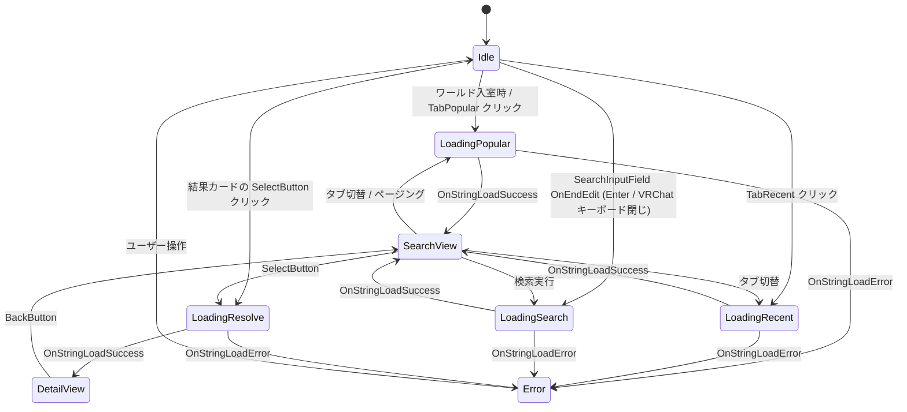

# VHub PlaylistViewer — Unity 側アーキテクチャ

> **対象**: 本リポジトリの Unity / UdonSharp 実装。
> **前提**: サーバー側仕様は [`server-api-spec.md`](./server-api-spec.md) を参照。
> **作成日**: 2026-04-27

## 0. 全体像

VRChat ワールドに 1 つ配置するだけで、ボード型 UI が表示され:
- VHub PlayList のプレイリストを **検索 / 人気 / 最近** で閲覧できる
- 詳細画面で **トラック一覧 + KawaPlayer 等に貼り付け用の URL** を表示

外部の動画プレイヤー (KawaPlayer 等) には **直接連携しない**。ユーザーが VRChat キーボードの Copy/Paste で手動で URL を渡す運用。

## 1. パッケージレイアウト

KawaPlayer (`com.vhub.kawaplayer`) と同じ慣習で、**リポジトリ直下を VPM パッケージ化**する。

```
KawaPlayer_PlaylistViewer/                    ← repo root = package root
├── package.json                                  VPM パッケージマニフェスト
├── README.md
├── LICENSE.md                                    (TBD, issue #15)
├── CHANGELOG.md
├── Runtime/
│   ├── MegaGorilla.KawaPlayer.PlaylistViewer.Runtime.asmdef
│   ├── Scripts/
│   │   ├── PlaylistViewerController.cs           メイン状態機械 + テーマカラー source-of-truth (#23 §13.5)
│   │   ├── ResultRow.cs                          結果カード 1 行、theme tint を controller から pull
│   │   ├── ListingClient.cs                      popular/recent クライアント
│   │   ├── SearchClient.cs                       search クライアント (VRCUrlInputField 経由)
│   │   ├── PlaylistResolver.cs                   /r/... resolve クライアント
│   │   ├── ThumbnailLoader.cs                    VRCImageDownloader プール (yt-thumb-direct, vhub-playlist#92)
│   │   ├── UISpinner.cs                          Loading overlay 用 Z 軸回転コンポーネント (#23 Phase A)
│   │   ├── Keypad3D.cs                           3D キーパッド (親)
│   │   └── KeypadKey.cs                          3D キーパッドの個別キー
│   ├── Sprites/                                   #23 Phase A foundational asset (Phosphor MIT 由来)
│   │   ├── UI_RoundedPanel.png                   9-slice 96×96, border 24
│   │   ├── UI_IconBack/Search/Refresh/Music/Error.png  各 128×128 単色白 + 透明背景
│   │   ├── UI_LoadingSpinner.png                 128×128 circle-notch、UISpinner で回転
│   │   └── UI_ThumbPlaceholder.png               256×256 dark navy + music icon α=0.4
│   ├── Prefabs/
│   │   └── PlaylistViewer.prefab                 (issue #12, Unity Editor 必須)
│   ├── Animations/
│   │   ├── PlaylistViewer.controller             (issue #13)
│   │   ├── ShowSearch.anim
│   │   └── ShowDetail.anim
│   └── Materials/                                (Unity Editor 必須)
├── Editor/
│   ├── MegaGorilla.KawaPlayer.PlaylistViewer.Editor.asmdef
│   └── Scripts/
│       ├── PoolGenerator.cs                      4 種 VRCUrl[] のベイク
│       ├── PoolGeneratorWindow.cs                Tools メニュー
│       └── AllowedDomainsHelper.cs               CustomEditor で導入手順表示
├── Documentation~/                               VPM の規約上 Unity が無視する
│   └── installation.md
├── docs/                                         開発者向け (本文)
│   ├── server-api-spec.md
│   └── unity-architecture.md (this)
└── _references/                                  (.gitignore 対象、参考実装の物理コピー)
```

## 2. 命名規約

### 2.1 アセンブリ / 名前空間

| asmdef | C# Namespace |
|---|---|
| `MegaGorilla.KawaPlayer.PlaylistViewer.Runtime` | `MegaGorilla.KawaPlayer.PlaylistViewer` |
| `MegaGorilla.KawaPlayer.PlaylistViewer.Editor` | `MegaGorilla.KawaPlayer.PlaylistViewer.Editor` |

### 2.2 Hierarchy 命名規約 (VIB 流儀)

prefab 内の子 GameObject 名で、用途を区別する:

| プレフィックス | 意味 |
|---|---|
| `#XXX` | スクリプトが (Start() でバインド or per-row 描画時に) アクセスする要素。読み取り / 書き込み問わず |
| `*XXX` | デザイナーが自由に編集できる装飾要素。スクリプトは触らない |
| (なし) | グルーピング用の中間オブジェクト。スクリプトの関心外 |

**重要: `BindHierarchy()` は `GetComponentsInChildren<Transform>(true)` で**インアクティブな子も含めて深さ優先で全走査**するため、テンプレート (例: `#ResultTemplate`, `#TrackTemplate`) の中にも同名の `#XXX` があると先に hit して上書きされる。これを避けるためトップレベル binding 名はテンプレート内 binding 名と被らせない:

| トップレベル (1 個だけ存在) | テンプレート内 (per-row, 複数 clone) |
|---|---|
| `#PlaylistName` (詳細ビュー) | `#Name` (検索結果カード) |
| `#OwnerName` (詳細ビュー) | `#Owner` (検索結果カード) |
| `#TotalTracks` (詳細ビュー、playlist 総トラック数) | `#TrackCount` (検索結果カード、playlist の trackCount) |

**主要な `#`-prefix 要素一覧** (実装の `Start()` でバインド or per-row 描画時に参照、Phase A-3 後の canonical 構造)。詳細な rect サイズ / anchor / pivot / 配線手順は §13.6 参照:

```
PlaylistViewer (Controller / ListingClient / SearchClient / PlaylistResolver / ThumbnailLoader)
└── Canvas (WorldSpace + BoxCollider + VRCUiShape, §13.2)
    ├── #Header                      (Canvas 直下、ビュー横断、§13.5/§13.6)
    │   └── #Title                   (TMP_Text "VHub PlaylistViewer")
    ├── #SearchView
    │   ├── #SearchBar               (検索入力 row、§13.6)
    │   │   ├── #SearchIcon          (Image, UI_IconSearch)
    │   │   └── #SearchInputField    (VRCUrlInputField、OnEndEdit → SendCustomEvent("RequestSearch")、§4.2)
    │   ├── #TabRow                  (HorizontalLayoutGroup)
    │   │   ├── #TabPopular          (Button、Button.onClick → OnTabPopular)
    │   │   └── #TabRecent           (Button、Button.onClick → OnTabRecent)
    │   │     ↑ 旧 #TabSearch は Phase A-3 で削除 (Enter-to-search 化)、News tab (vhub-playlist#97) で将来追加予定
    │   └── (ScrollRect: Viewport / Content) — Pre-allocated 20 行 (§5.3)
    │       ├── #ResultRow0          (ResultRow UdonBehaviour、_index=0)
    │       │   ├── #Thumbnail       (RawImage)
    │       │   ├── #Name            (TMP_Text)
    │       │   ├── #Owner           (TMP_Text)
    │       │   ├── #TrackCount      (TMP_Text)
    │       │   └── #SelectButton    (Button、行全 stretch、行クリックで OnSelect)
    │       └── #ResultRow1..#ResultRow19 (同構造、_index=1..19)
    ├── #DetailView
    │   ├── #DetailHeader            (Phase A-3 で新設、§13.6)
    │   │   ├── #BackButton          (Button、左寄せ、Button.onClick → OnBackToSearch)
    │   │   │   └── #Icon            (Image, UI_IconBack)
    │   │   └── #SectionTitle        (TMP_Text "プレイリスト詳細")
    │   ├── #PlaylistThumbnail       (Phase A-4: cover art、RawImage 200×200 左、ytThumbIndex から LoadYtThumbnail)
    │   ├── #PlaylistName / #OwnerName / #TotalTracks (cover row 右列、Phase A-4 で reposition)
    │   ├── (ScrollRect tracks)
    │   │   └── #TrackListContent
    │   │       └── #TrackTemplate   (非アクティブ default、§13.1.2、Phase A-4 で card-styled: BG=`UI_RoundedPanel` α=0.08 + height 60)
    │   │           ├── #Position    (左 40 幅、center align、muted color)
    │   │           └── #Title       (右 stretch、left align、primary color)
    │   └── #UrlLabel / #UrlField    (TMP_InputField、readOnly、コピー専用)
    ├── #LoadingOverlay              (Canvas 直下)
    │   ├── #LoadingMessage          (TMP_Text)
    │   └── #LoadingSpinner          (Image UI_LoadingSpinner + UISpinner UdonBehaviour、§13.6)
    └── #ErrorOverlay                (Canvas 直下)
        ├── #ErrorMessage            (TMP_Text)
        └── #ErrorIcon               (Image UI_IconError, errorColor tint)
```

**Pre-allocated `#ResultRow0..#ResultRow19`** は Pre-allocated 20 行方式 (§5.3) によるもので、動的 `Instantiate` は **行わない**。Controller は `RenderResultList` でこの固定 20 行に対して `SetData(name, owner, trackCount, ytThumbIndex)` を呼び、余剰行は `Hide()`。旧 `#ResultListContent` / `#ResultTemplate` clone 方式は廃止 (PR #28 / #33 で実装済)。

**`#TrackTemplate`** (DetailView 内のトラック一覧) は **clone-template 方式を維持** (Click event を持たない単純表示のため)。default では `SetActive(false)` 必須 (§13.1.2)。

**ページング UI** (旧 `#PrevPageBtn / #NextPageBtn / #PageLabel`) は v1 prefab には未実装 (Controller の `_pageLabel` field は null 許容で binding 任意)。必要になり次第追加。

**v1 では検索入力に 3D キーパッドを使わない**: `Keypad3D` / `KeypadKey` は repo に同梱されているが汎用 TMP_InputField 用ユーティリティとしての位置付けで、v1 prefab には含めない。理由は §12 を参照。

## 3. 状態機械

`PlaylistViewerController` が保持する状態:



## 4. データフロー

### 4.1 popular/recent (人気/最近) ロード

```
[Tab Popular Click]
  → controller.RequestPopular(0)
    → listingClient.LoadPopular(0)
      → _popularPagePool[0] (baked VRCUrl) を VRCStringDownloader.LoadUrl
        → OnStringLoadSuccess(json)
          → controller.OnListingResultReceived(json)
            → 内部で JSON パース (DataDictionary)
            → 事前配置された #ResultRow0..19 (固定 20 行) に SetData (§5.3)
            → SetData 内で各 ytThumbIndex に対し
              thumbnailLoader.LoadYtThumbnail(ytThumbIndex, rawImage)
```

### 4.2 search (検索)

```
[ユーザーが #SearchInputField (VRCUrlInputField) をタップ]
  → VRChat 内蔵キーボードが起動 (Copy/Paste も可)
  → ユーザーがキーボードでクエリ部分を編集
  → OK で確定すると _searchInputField.text に反映され、OnEndEdit 発火

[OnEndEdit (Enter / VRChat キーボード閉じ) — UnityEvent persistent listener]
  → Controller UdonBehaviour.SendCustomEvent("RequestSearch")
    → controller.RequestSearch()
      → searchClient.SubmitSearch()
        → VRCUrl url = _searchInputField.GetUrl()  (VRChat の検証経由で VRCUrl 生成)
        → VRCStringDownloader.LoadUrl(url, this)
          → OnStringLoadSuccess(json)
            → controller.OnListingResultReceived(json)
```

(Phase A-3 で Search タブを廃止し、上記 Enter-to-search 方式に統一。詳細は §13.6)

注: 当初は 3D キーパッドからの直接入力を検討していたが、Unity 実機検証で **`VRCUrlInputField.text` setter が Udon 非公開** であることが判明。3D キーパッドからの書き込み経路は塞がれているため、v1 は VRChat 内蔵キーボード方式に統一する。詳細は §6 を参照。

### 4.3 detail 表示 (resolve)

```
[ResultRow SelectButton Click]
  → ResultRow.OnSelect → controller.OnSelectResultByIndex(rowIndex)
    → resolver.Resolve(resolveIndex, playlistId)
      → _resolvePool[resolveIndex] (baked VRCUrl, /vrcurl/playlist/{i}) を LoadUrl
        → サーバーが 200 + JSON を**直接**返す
          (vhub-playlist#91 v4 デプロイ済。旧 302 → /r/default/{playlistId} 方式は
           VRCStringDownloader が redirect follow しないため廃止)
      → OnStringLoadSuccess(json)
        → controller.OnPlaylistResolved(json, playlistId)
          → トラック一覧描画 (#TrackTemplate clone)
          → #UrlField.text = "https://playlist.vrc-hub.com/r/default/{playlistId}"
            (KawaPlayer 等への貼付用 URL、表示専用、内部 fetch はしない)
          → SetState(STATE_DETAIL_VIEW) → SetActive で SearchView ↔ DetailView 切替
            (Animator は optional、α fade 等の演出担当 #13)
```

## 5. VRCUrl ベイク戦略

### 5.1 Pool の種類 (v4 / Phase A 時点)

| フィールド | 内容 | 生成方法 / サイズ |
|---|---|---|
| `_resolvePool: VRCUrl[]` (PlaylistResolver) | `https://playlist.vrc-hub.com/vrcurl/playlist/{0..N-1}` | template 展開 (`{i}`)、サイズ Inspector 入力 (default 1024) |
| `_ytThumbPool: VRCUrl[]` (ThumbnailLoader) | `https://i.ytimg.com/vi/{videoId}/mqdefault.jpg` (vhub-playlist#92 v4)、**i.ytimg.com 直接 baked** で trusted host から redirect なし取得 | server `/api/vrc/yt-thumb-direct-baking?cursor=N` から **dynamic fetch**、index 保持 dense array (欠番は empty `VRCUrl`)。サイズ入力なし |
| `_popularPagePool: VRCUrl[]` (ListingClient) | `https://playlist.vrc-hub.com/api/vrc/playlists/popular?p={0..P-1}` | template 展開、サイズ Inspector 入力 (default 50 = 1000 件まで) |
| `_recentPagePool: VRCUrl[]` (ListingClient) | `https://playlist.vrc-hub.com/api/vrc/playlists/recent?p={0..P-1}` | 同上 (default 50) |

旧 `_thumbPool` (`/vrcurl/default-thumb/{i}` → 302 → `i.ytimg.com`) は **廃止** (PR #29 で削除済)。VRCImageDownloader が redirect を follow しないため、また `playlist.vrc-hub.com` が untrusted host で「Allow Untrusted URLs OFF プレイヤー」で表示できなかった (vhub-playlist#92 経緯)。

### 5.2 ベイク手順

`PoolGeneratorWindow` (Editor) が以下を行う:

1. ユーザーが **Tools > VHub PlaylistViewer > Generate Pools** を開く
2. シーン中の `PlaylistViewerController` を選択
3. Base URL / Resolve Pool ID / Resolve Pool Size / Listing Pages を設定 (yt-thumb-direct はサーバー fetch のためサイズ入力なし、HelpBox で明示)
4. **Validate** ボタンで `/r/{resolvePoolId}/_validate` を叩いて疎通確認
5. **Generate** ボタンで:
   - resolve / popular / recent pool は template 展開で生成 → reflection で代入
   - **yt-thumb-direct pool は `/api/vrc/yt-thumb-direct-baking` を paged fetch** (cursor + nextCursor、`pageSize=1000`、最大 100 page = 100k 件 safety) → server 返却 `index` を保持して dense `VRCUrl[]` 生成 → reflection で `ThumbnailLoader._ytThumbPool` に代入
   - 失敗時 (負 index / 重複異 URL / safety 枯渇 + nextCursor 残) は **fail closed** で `null` 返却 + error message
6. `EditorUtility.SetDirty()` + `AssetDatabase.SaveAssets()` で永続化

KawaPlayer の `PlaylistLoaderEditor.cs` の Reflection パターンを踏襲する。

### 5.3 結果カード描画戦略 — Pre-allocated 20 行方式

検索結果カードは **prefab に 20 個の `#ResultRow0` 〜 `#ResultRow19` を物理配置**し、各行に `ResultRow.cs` (UdonBehaviour、`_index = N` をハードコード、`_controller` 参照) を持たせる。Controller は描画時に **Instantiate しない** :

- `count <= 20` 行: `_resultRows[i].SetActive(true)` + 各フィールド (`#Name` / `#Owner` / `#TrackCount` / `#Thumbnail`) を更新
- `count > 20` 行: 余剰は `SetActive(false)` で隠す
- 各行の `#SelectButton.onClick` → `ResultRow.OnSelect()` → `_controller.OnSelectResultByIndex(_index)`

採用理由 (#12 で確定):
- Unity `Button.onClick` の persistent UnityEvent は **prefab 時点の固定パラメータ**しか渡せず、Instantiate clone してもパラメータは更新されない
- UdonSharp は lambda capture をサポートしないため、`btn.onClick.AddListener(() => ...)` で動的に index を捕まえる手も使えない
- listing API のページサイズが 20 固定なので動的 clone の利点が薄い
- 固定行ベースの方が prefab 上でレイアウトのプレビュー・デバッグが容易、VRChat 実機での Instantiate コストもゼロ

**トラック一覧 (`#TrackTemplate`) は Click イベントを持たない**ため Instantiate clone を継続する。問題が起きるのは「動的生成した Button から親へ row index を渡す」場面のみで、トラック行はその制約に該当しない。

`PlaylistViewerController.RenderResultList` は既にこの Pre-allocated 20 行方式で実装済 (`Runtime/Scripts/PlaylistViewerController.cs` L401-436)。`OnSelectResultByName(string)` 系の旧 API は存在しない。

## 6. 各 Runtime UdonBehaviour の責任

| クラス | 責任 | 主な依存 |
|---|---|---|
| `PlaylistViewerController` | 状態機械、UI バインド (§13.6 BindHierarchy で `#PlaylistThumbnail` 含め自動バインド)、子コンポーネント協調、テーマカラー source-of-truth (§13.5)、active tab tracking、SetActive ベース view 切替 (Animator は #13 で optional 演出担当)、listing item から `_pendingOwnerName` / `_pendingYtThumbIndex` を carry-over して DetailView の cover art に反映 (Phase A-4) | UnityEngine.UI, TMPro, VRC.SDK3.Data |
| `ListingClient` | popular / recent ページの GET、JSON パース | VRC.SDK3.StringLoading |
| `SearchClient` | 検索 URL の動的取得 (VRCUrlInputField) と GET | VRC.SDK3.StringLoading |
| `PlaylistResolver` | /vrcurl/playlist/{i} の GET (vhub-playlist#91 v4: 200 JSON 直接)、トラック一覧パース | VRC.SDK3.StringLoading |
| `ThumbnailLoader` | yt-thumb-direct pool (i.ytimg.com 直接 baked、vhub-playlist#92 v4) からサムネ取得、FIFO キュー + LRU キャッシュ | VRC.SDK3.Image |
| `UISpinner` | Z 軸回転だけの極小コンポーネント、Loading overlay spinner 用 (§13.6) | UnityEngine |
| `Keypad3D` | 3D キーパッドの親、文字 append/backspace/submit (v1 では未使用、汎用ユーティリティ) | UnityEngine.UI |
| `KeypadKey` | 個別キー、Interact で親に SendCustomEvent | (Udon Interact) |
| `ResultRow` | 結果カードの 1 行分の状態 (固定 `_index`)、`SetData(name, owner, trackCount, ytThumbIndex)` で表示更新、`Start` で controller theme から色を pull、`#SelectButton.onClick` → `OnSelect` → `Controller.OnSelectResultByIndex(_index)` | UnityEngine.UI, TMPro |

すべて `[UdonBehaviourSyncMode(BehaviourSyncMode.None)]`。

## 7. UI レイアウト想定

WorldSpace Canvas、ボード型 (横長)。サイズの目安:

```
+--------------------------------------------------+
| Search [Popular] [Recent]                        |
| Query: [__________________]   < 1/12 >  [Search] |
| +------+------+------+------+                    |
| | thumb| thumb| thumb| thumb|  (1 列 4 枚 × 5 行) |
| | name | name | name | name |                    |
| | by Y | by Y | by Y | by Y |                    |
| | 12 t.| 12 t.| 12 t.| 12 t.|                    |
| +------+------+------+------+                    |
| ...                                              |
+--------------------------------------------------+

[Detail view: スライドして表示]
+--------------------------------------------------+
| ←Back | お気に入りカラオケ (12 tracks)            |
| Owner: Mega Gorilla                              |
| ┌──────────────────────────────────────────┐  |
| │ https://playlist.vrc-hub.com/r/default/V…│  |
| └──────────────────────────────────────────┘  |
| (タップして VRChat キーボードで Copy)            |
| 1. Track A                                       |
| 2. Track B                                       |
| ...                                              |
+--------------------------------------------------+
```

3D キーパッドはボードの下や横に物理配置。ユーザーが指で押す。

## 8. VRChat 側で必要な世界設定

ワールド製作者が **VRChat サイト > My Worlds > 該当ワールド > Video Player Allowed Domains** に以下を追加する必要がある:

- `playlist.vrc-hub.com`

これがないと `VRCStringDownloader` も `VRCImageDownloader` も**ブロック**される。`AllowedDomainsHelper` がインスペクター上にチェックリスト形式で表示する。

## 9. 同期 / マルチプレイヤー対応

**v1 では同期しない**。各プレイヤーが個別に検索・閲覧する設計:

- `[UdonBehaviourSyncMode(BehaviourSyncMode.None)]`
- `[UdonSynced]` フィールドなし
- `RequestSerialization()` 不使用

これにより:
- 後から入室したユーザーも自分で検索できる
- 一人が detail を開いても他の人の画面は変わらない
- ネットワーク負荷ゼロ

将来的に「ホストが選んだプレイリストを全員に配信」のような機能が必要になれば、別 issue で `Manual` モードに切り替える。

## 10. Udon コーディング規約

KawaPlayer / VIB から学んだベストプラクティス:

| 項目 | 方針 |
|---|---|
| データ構造 | `VRC.SDK3.Data.DataList` / `DataDictionary` を優先 |
| JSON | `VRCJson.TryDeserializeFromJson` |
| HTTP | `VRCStringDownloader.LoadUrl` (callback: `OnStringLoadSuccess` / `OnStringLoadError`) |
| 画像 | `VRCImageDownloader.DownloadImage` (callback: `IUdonEventReceiver`) |
| 配列 | プリアロケート優先。動的成長が必要なら `DataList` |
| 文字列 | `string.Format` は使えない場合あり (Udon サポート外) → `+` 連結 |
| LINQ | 使えない |
| 例外 | try/catch は限定的 (Udon でも一応サポート) |
| イベント | `SendCustomEvent` / `SendCustomEventDelayedSeconds` |
| 多言語 | CSV 文字列定数 (`"en,Tracks,ja,曲"`) を `Split(',')` してパース。`OnLanguageChanged` で再描画 |

## 11. テスト戦略

### 11.1 静的検証 (本ターン実施)

- C# 構文 (汎用 IDE で確認)
- asmdef の参照整合性
- package.json の VPM 仕様準拠

### 11.2 Unity Editor での検証 (次回作業)

- UdonSharp コンパイル成功
- PoolGeneratorWindow 起動確認
- prefab を空シーンに配置して 4 種 pool ベイク

### 11.3 実機テスト (prefab 完成後)

- VCC でテストワールドプロジェクトに本パッケージ追加
- Allowed Domains 設定
- ワールドアップロード
- 入室して popular/recent/search が動作するか
- KawaPlayer が同シーンにあれば、URL Copy → Paste で再生できるか

## 12. 既知の制約 / 留意事項

1. **Search 機能は VRChat の Allowed Domains 経由でしか動作しない** — テスト時にローカルワールドでは制限がかかる場合あり
2. **VRCImageDownloader の同時ダウンロード数制限** — VRChat 側の仕様で詳細不明。多数のサムネを一度に表示する場合、キューイング必要
3. **Server v4 前提** — resolve 200 JSON ([vhub-playlist#91](https://github.com/kisaragi-official/vhub-playlist/issues/91)) と yt-thumb-direct baking API ([vhub-playlist#92](https://github.com/kisaragi-official/vhub-playlist/issues/92)) が必要 (両方 PR merged + 本番デプロイ済 / 2026-05-01)。古い `default-thumb` redirect pool は使用しない (PR #29 で client から削除済)
4. **`VRCUrlInputField.text` setter は Udon に非公開**:
   - Unity 実機検証で UdonSharp が `Method is not exposed to Udon: '_targetField.text'` エラーを出すことが判明
   - 結果: 3D キーパッドを含む任意の Udon コードから VRCUrlInputField のテキストフィールドへの書き込みは不可
   - VRCUrl の runtime 構築は `VRCUrlInputField.GetUrl()` のみ、そのフィールドへの入力は **VRChat 内蔵キーボード経由でしか出来ない**
   - 影響: v1 では検索 UX を 3D キーパッドではなく VRCUrlInputField + VRChat キーボードに統一 (§4.2 参照)
   - `Keypad3D` / `KeypadKey` は将来の汎用 TMP_InputField ユーティリティとして repo に残すが (#9, A: 残す)、**v1 prefab には含めない**
5. **VRCUrlInputField の prefix プリセット**: API URL のプレフィックスを Inspector で `_searchInputField.text` にプリセットしておく。VRChat キーボードでユーザーが prefix 部分を消すリスクは `SearchClient.SubmitSearch()` の prefix 検証 (line 50 付近) で弾く

## 13. VRChat 環境固有の注意点 / 公式仕様 (実装で踏みやすい罠)

実機 VR テストで判明した、VRChat 公式 docs に記載されているが **見落としやすい仕様** をまとめる。Editor 上では正常に見えても **実機 build で症状が顕在化** するケースが多い。

### 13.1 TextMeshPro: `TMP_Settings.fallbackFontAssets` は **空にする**

#### 仕様 (公式)
[creators.vrchat.com/worlds/components/textmeshpro/](https://creators.vrchat.com/worlds/components/textmeshpro/) より:

> "go to 'Project Settings' > 'TextMeshPro settings' remove all 'Fallback Font Assets.' (...) missing Unicode characters will appear as boxes in the Unity editor, but **appear correctly after uploading your world to VRChat**."

つまり **TMP_Settings.fallbackFontAssets を空にする** ことで VRChat の **内蔵 fallback fonts (日本語含む)** が build 時に自動 inject される。

#### 罠
逆に「日本語表示するため」と思って TMP_Settings.fallbackFontAssets に独自 SDF (例: M PLUS / Noto Sans CJK) を追加すると、**VRChat 内蔵 fallback が override されて無効化** される。結果、各 TMP_Text の font asset 自身でカバーできない glyph は □ で表示される。

#### 推奨設定
- `Project Settings > TextMeshPro Settings > Fallback Font Assets` リストは **空** に保つ
- 各 TMP_Text の `font` は VRChat SDK 同梱の `LiberationSans SDF` (default) でも、独自 SDF (M PLUS 等) でもよい
- Editor 上では未対応 glyph が □ になるが **実機では VRChat fallback で正しく表示される** (許容)

#### 実例
本パッケージの testing-chamber では、当初 M PLUS Rounded 1c + Noto Sans を TMP_Settings global fallback に追加したが、実機で日本語表示できない症状が発生。**TMP_Settings global fallback を空にしただけで解決**した。詳細は本リポジトリ issue 履歴。

#### 13.1.1 TMP `overflow=Ellipsis` / `Truncate` は頂点ゼロ bug、`Overflow` のみ動作

TMP_Text の `enableWordWrapping=false` + `overflowMode=Ellipsis` (or `Truncate`) の組合せで、`textInfo.meshInfo[0].vertexCount = 0` となり **何も描画されない**現象を testing-chamber 実機で確認 (2026-05-01)。Unity Editor の Game/Scene ビューでも再現。

確実に動作するのは:
- `enableWordWrapping=true (Normal)` + `overflowMode=Overflow` (= TMP デフォルト)

→ **すべての TMP_Text を `wrap=Normal + overflow=Overflow` で統一** + 長文は **C# 側で pre-truncate** (末尾「…」付加) する方針が安全:

```csharp
// ResultRow.cs / PlaylistViewerController.cs に実装済の helper
private string TruncateString(string s, int maxChars)
{
    if (s == null) return "";
    if (maxChars <= 0 || s.Length <= maxChars) return s;
    return s.Substring(0, maxChars) + "…";
}

// 使用例 (ResultRow.SetData)
if (_nameText != null) _nameText.text = TruncateString(name, _nameMaxChars);
```

#### 罠
- TMP の Ellipsis モードは「自動 …省略」してくれるので一見便利だが、**VRChat 環境では vertex generation が失敗**して文字消失する
- 各 TMP_Text を Ellipsis にしても Editor (Game ビュー) で見えない → font/material 問題に見えるが **真因は wrap/overflow 設定**
- max chars (`_nameMaxChars` 等) は Inspector で調整可能、font size と RectTransform width に応じて適切な値を設定

#### 13.1.2 Clone-template GameObject は **`SetActive(false)` を default にする**

`PlaylistViewerController.RenderTrackList` は `#TrackTemplate` を `Instantiate` してトラック行を生成する pattern (`Runtime/Scripts/PlaylistViewerController.cs` L467-510)。`#TrackTemplate` 自身は scene/prefab で **`SetActive(false)` 既定**にしておく必要がある:

- 既定 active=true だと、初回 listing 表示前に template の placeholder text (例: `"No."` `"New Text"`) がそのまま見える状態になる
- Instantiate 後に `row.SetActive(true)` で複製のみ表示、template 本体は隠れたまま

Pre-allocated 20 行 (`#ResultRow0..19`) と異なり template-clone 方式 (`#TrackTemplate`) は **template 本体を隠す責任が scene セットアップ側**にある (script は複製生成のみ)。

### 13.2 World Space Canvas に必要な VR pointer 受信 component

VR pointer (LeftHand/RightHand のレーザービーム) が UI と interact するには、**Canvas に以下の 4 component が必要**:

| Component | 役割 |
|---|---|
| `Canvas` (`renderMode = WorldSpace`) | World 内描画 |
| `CanvasScaler` (`Constant Pixel Size`) | DPI 制御 |
| `GraphicRaycaster` | UI 要素への raycast |
| **`BoxCollider`** | **VR pointer の物理 raycast 受信** (size = Canvas RectTransform 全体、`isTrigger = true`) |
| **`VRCUiShape`** (`VRC.SDK3.Components.VRCUiShape`) | **SDK3 の正式 component**。BoxCollider と組合せて VR pointer 互換 |

加えて:
- Canvas の `Layer` は **`Default` (0)** に設定 (`UI` レイヤー (5) は VRChat 内で別扱いされ反応しないケースあり)
- Scene に **EventSystem** + `StandaloneInputModule` (or VRChat 推奨の input module) が存在
- ScrollRect の Mask 用 `Image.raycastTarget = true` (false だとスクロール反応しない)

#### 罠
`GraphicRaycaster` だけ付けても VR pointer は反応しない。**`BoxCollider` + `VRCUiShape` の両方が必須**。Editor の Game ビューではマウス click で動くので bug に気付きにくい。

### 13.3 VRCImageDownloader / VRCStringDownloader の制約

[creators.vrchat.com/worlds/udon/image-loading/](https://creators.vrchat.com/worlds/udon/image-loading/) で公式明記:

#### 13.3.1 Redirect 不可
> "URL redirection is not allowed and will result in an error."

**`VRCImageDownloader` は HTTP 302 redirect を一切 follow しない**。直接 image URL を baked する必要あり。`VRCStringDownloader` も同様の制約があると testing-chamber 実機で確認済 (resolve API の `/vrcurl/playlist/{i}` → 302 → `/r/default/{playlistId}` で error 発生)。

#### 13.3.2 Rate limit
> "One image can be downloaded every five seconds (...) this limit applies to your entire scene"

**5 秒に 1 件、scene/instance 全体で共有**。20 件並列 = 100 秒。queue 最大 1000 件、超過分 drop、実行順ランダム。

#### 13.3.3 Trusted Image Hosts (allowlist)
ImageDownloader は 13 ドメインを **trusted host** として許可:

```
DisBridge, Dropbox, GitHub, ImageBam, ImgBB, imgbox, Imgur,
Postimages, Reddit, Twitter, VRCDN, VRChat, Ytimg
```

非 trusted ドメイン (例: `playlist.vrc-hub.com`) は player 個人設定 **「Allow Untrusted URLs」 ON** が必要 = UX 劣化。`i.ytimg.com` (Ytimg) は trusted で OK。

#### 罠
- API のレスポンスから取得した URL string は **VRCUrl runtime 構築不可** で baked にできない
- `playlist.vrc-hub.com` の image proxy 案は untrusted host 問題で UX 劣化
- → 解決策は **Editor 時に baked URL[] に i.ytimg.com 等の trusted host URL を直接書き込む** 設計 ([vhub-playlist#92](https://github.com/kisaragi-official/vhub-playlist/issues/92) PR #94 merged + 本番デプロイ済、client 側 PR #29 merged + 実機サムネ表示確認済 / 2026-05-01)

### 13.4 Editor 表示と実機表示の挙動差 (要許容)

VRChat 環境では **Editor で正しく見える ≠ 実機で正しく見える**、また逆も成立する場面が多い:

| 現象 | Editor | 実機 |
|---|---|---|
| TMP の日本語 (TMP_Settings 空時) | □ で見える | ✅ VRChat fallback で正常表示 |
| VRCImageDownloader 動作 | ❌ ClientSim では未動作 (既知制約) | ✅ 実機では動作 |
| VRCStringDownloader 動作 | ❌ Edit モードでは未動作 | ✅ 実機 (Play / VR) で動作 |
| VR pointer / レーザー操作 | マウス click で代替 | VR controller で実 raycast |

→ **debug の主要手段は VR 実機 build & test**。MCP 経由 SerializedObject 値 dump + 実機ログ (`%LocalAppData%/Low/VRChat/VRChat/output_log_*.txt`) の併用が効率的。Editor 表示だけで判断しない。

### 13.5 Theme color システム (#23 Phase A)

#### 設計方針

UI 全体の配色を 1 箇所 (`PlaylistViewerController` の Inspector) で管理し、各サブコンポーネントは controller から色を **pull** する。色は `[SerializeField] Color` フィールド + `public Color XxxColor => _xxxColor` 公開プロパティで露出。

**理由**:
- ScriptableObject はワールド配布 unitypackage で共有しにくく、Udon は SO 直参照に制約が多い → 直 Inspector フィールドが最もシンプル
- 各 row が個別に色を持つと変更時に 20 箇所更新が必要 → controller を single source of truth に
- `#`-prefix 自動 hierarchy バインドではなく **明示 `[SerializeField]` 配線** にしたのは: (1) 配線対象 Image が 3-5 件と少ない (2) 種別ごとに array で渡したい (例: `_surfacePanels[]`)

#### Color group (default 値)

| フィールド | default | 用途 |
|---|---|---|
| `_primaryColor` | `#4A90E2` (RGB 0.29/0.56/0.89) | 選択中タブ、Action ボタン |
| `_surfaceColor` | white α=0.08 | カード / 非選択タブ / 入力欄背景 |
| `_surfaceHoverColor` | white α=0.16 | ResultRow hover/press |
| `_overlayColor` | navy (13,18,30) α=0.85 | Loading / Error overlay 全面背景 |
| `_textPrimaryColor` | white | タイトル / 主要 text |
| `_textMutedColor` | white α=0.6 | 補足 text (Owner / TrackCount) |
| `_errorColor` | `#E55353` (0.9/0.33/0.33) | Error icon / アラート |

#### 適用パターン

- **Static panels**: `_surfacePanels[] / _overlayPanels[] / _errorIcon` に Inspector で Image 配列 wire → `Start` の `ApplyThemeOnStart()` が `image.color = surfaceColor` 等で一括 tint
- **Active state (タブ)**: 現状 visible なのは `_tabPopularBg` / `_tabRecentBg` の **2 タブのみ** (Phase A-3 で `#TabSearch` 削除、Search は input field の `OnEndEdit` で発火)。`_tabSearchBg` は **互換のため script に残るが意図的に null** (`UpdateTabVisuals` は null 安全)、News tab ([vhub-playlist#97](https://github.com/kisaragi-official/vhub-playlist/issues/97)) デプロイ後に再利用 or 削除を判断。`_activeTabIndex` (-1/0/1/2) を `RequestPopular/Recent/Search` で更新 → `UpdateTabVisuals()` が **active タブ = `_primaryColor`、inactive = `_surfaceColor`** を都度設定
- **Hover/press (ResultRow)**: 各 ResultRow.Start で `ColorBlock cb = button.colors; cb.normalColor = surfaceColor; cb.highlightedColor = surfaceHoverColor; ...; button.colors = cb;` を controller の theme から流し込む。Image.color 自体は `Color.white` 維持し、Button の ColorTint multiply で実効 α を生成

#### 罠
- Editor 表示 (Edit Mode) では `Start()` が走らないため theme tint 未適用 → MCP で確認するときは手動で同色を Image.color に流し込んで preview する
- `ColorBlock` は struct なので `button.colors.normalColor = ...` 直接代入は no-op、必ず `var cb = button.colors; cb.normalColor = ...; button.colors = cb;` で write back する (UdonSharp 1.x で動作確認済)

### 13.6 Modern UI sprites + scene 配線手順 (#23 Phase A)

#### Sprites (`Runtime/Sprites/`)

すべて **白 + 透明背景**の単色テクスチャ。Image.color tint で任意のテーマ色に変化させる戦略。

| sprite | 由来 | サイズ | 9-slice border | 用途 |
|---|---|---|---|---|
| `UI_RoundedPanel` | プログラム生成 (Pillow) | 96×96 | 24 (全方向) | 全 button + card + panel 背景 (`Image.type=Sliced` で任意サイズに stretch、コーナー 24px 維持) |
| `UI_IconBack` | Phosphor `arrow-left-bold` | 128×128 | — | DetailView `#BackButton` |
| `UI_IconSearch` | `magnifying-glass-bold` | 128×128 | — | `#SearchInputField` 周辺 |
| `UI_IconRefresh` | `arrow-clockwise-bold` | 128×128 | — | (将来) listing reload |
| `UI_IconMusic` | `music-notes-bold` | 128×128 | — | サムネ placeholder 中央 |
| `UI_IconError` | `warning-bold` | 128×128 | — | `#ErrorOverlay` 中央装飾 |
| `UI_LoadingSpinner` | `circle-notch-bold` | 128×128 | — | `#LoadingOverlay` 中央、`UISpinner` で Z 軸回転 |
| `UI_ThumbPlaceholder` | navy + music α=0.4 合成 | 256×256 | — | `#Thumbnail` placeholder fallback |

Phosphor Icons は **MIT** ライセンス。本リポジトリ license 確定後 (#15) `THIRD_PARTY_NOTICES.md` で attribution 予定。

#### Canvas hierarchy / レイアウト (Phase A-3 reorganized、768×1024 portrait)

Canvas を **4-row 階層** で構成し、Header はビュー横断、SearchView/DetailView 内で section header → meta → scroll の順に並べる:

```
Canvas (768×1024, WorldSpace, BoxCollider+VRCUiShape)
├── #Header                    (top-stretch, 88px) — ビュー横断、常時表示の brand title
│   ├── BG: UI_RoundedPanel (surface tint via _surfacePanels[])
│   └── #Title TMP "VHub PlaylistViewer" (font 48, primary color, center)
├── #SearchView                (中央 marker、children は世界座標で配置)
│   ├── #SearchBar             (anchoredPos y=380, size 720×64) — 検索入力 row
│   │   ├── BG: UI_RoundedPanel (surface)
│   │   ├── #SearchIcon        (left, anchor 0,0.5, size 40×40) UI_IconSearch (text-muted tint)
│   │   └── #SearchInputField  (stretch、56px left padding for icon、16px right)
│   ├── #TabRow                (anchoredPos y=312, size 720×56) — タブ row
│   │   └── HorizontalLayoutGroup (childForceExpandWidth、spacing=8)
│   │       ├── #TabPopular    (HLG が幅再計算、~356×56 で 50% 配分)
│   │       └── #TabRecent     (将来 News tab 追加時に 3 分割に戻る予定、vhub-playlist#97)
│   └── Scroll View            (anchoredPos y=-114, size 720×780) — 結果カードリスト
│       └── Viewport / Content / #ResultRow0..19
├── #DetailView                (stretch fills canvas)
│   ├── #DetailHeader          (top-stretch, anchoredPos y=-104, size auto×64) — Back + section title
│   │   ├── BG: UI_RoundedPanel (surface)
│   │   ├── #BackButton        (left, 56×48、UI_RoundedPanel BG + #Icon UI_IconBack 28×28 center)
│   │   └── #SectionTitle TMP  "プレイリスト詳細" (font 36, center)
│   ├── #PlaylistName          (anchoredPos y=-219, size auto×70)
│   ├── #OwnerName             (anchoredPos y=-274, size auto×30)
│   ├── #TotalTracks           (anchoredPos y=-274, size auto×30)
│   ├── Scroll View            (stretch, anchoredPos y=-26, sizeDelta -40,-573)
│   └── #UrlLabel / #UrlField  (bottom-anchored、既存維持)
├── #LoadingOverlay            (stretch fills canvas)
│   ├── BG: Image (overlay tint via _overlayPanels[])
│   ├── #LoadingSpinner        (center, size 96×96, UI_LoadingSpinner + UISpinner)
│   └── #LoadingMessage TMP
└── #ErrorOverlay              (stretch fills canvas)
    ├── BG: Image (overlay tint)
    ├── #ErrorIcon             (center anchoredPos (0, 80), size 96×96, UI_IconError, errorColor)
    └── #ErrorMessage TMP
```

**設計判断**:
- `#Header` を Canvas 直下にしたのは **ビュー横断で常時表示** (DetailView 表示時も title 維持)
- `#SearchView/#DetailView` は **section grouping marker** で、SetActive(true/false) で切替対象 → 中身の組み換えは保ちつつ、controller の SetState ロジックは維持
- `#SearchBar` `#TabRow` `#DetailHeader` は **明示的グルーピング container** で、見た目だけでなく hierarchy 上で関係性を表現 → prefab 化担当者・将来のデザイナーが構造を読みやすく
- `#TabRow` は HorizontalLayoutGroup で **タブ等幅自動配置** (手動座標指定の y バラつき問題を排除)
- **検索の発火**: 旧 `#TabSearch` button は廃止し、`#SearchInputField` (VRCUrlInputField) の **`OnEndEdit` (Enter / VRChat キーボード閉じ)** で `Controller.RequestSearch` を発火。`Search` タブの「タブ?入力欄?」曖昧さを解消、空 slot は将来 News タブ ([vhub-playlist#97](https://github.com/kisaragi-official/vhub-playlist/issues/97)) で埋める想定
- `#DetailHeader` の section title (`プレイリスト詳細`) は **静的テキスト** で localization は別途検討 (V1 は日本語固定)

#### 再構築用 scene 配線手順 (prefab 化 #12 で必要)

testing-chamber で動作確認済の手順。`#12` で `Runtime/Prefabs/PlaylistViewer.prefab` を export する際の参考:

1. **Tab Image** (`#TabPopular/Recent`): sprite=`UI_RoundedPanel`、type=Sliced、color=white。`Button.transition = None` (色は controller が制御)。HLG 内では sizeDelta 0、anchor (0,0)-(1,1)。Button.onClick → `Controller` UdonBehaviour `SendCustomEvent` mode=String、strArg=`OnTabPopular` / `OnTabRecent`
2. **ResultRow `#SelectButton`** (20 行): sprite=`UI_RoundedPanel`、type=Sliced、color=white。`Button.transition = ColorTint` (ResultRow.Start が Button.colors を上書き)
3. **`#Header`** (Canvas 直下): anchor top-stretch (0,1)-(1,1) pivot (0.5,1) anchoredPos (0,-8) size (-16, 88)、Image sprite=`UI_RoundedPanel` Sliced color=white surface tint。Title TMP child (text "VHub PlaylistViewer" font 48 white center)
4. **`#SearchBar`** (`#SearchView` の child): anchor (0.5,0.5)-(0.5,0.5) anchoredPos (0,380) size (720,64)、Image surface tint、`#SearchInputField` を再 parent + `#SearchIcon` (UI_IconSearch、left 16px、size 40×40) child 追加。`#SearchInputField` (VRCUrlInputField) の **`OnEndEdit` UnityEvent** に persistent listener を 1 件追加 (target=`Controller` の UdonBehaviour、method=`SendCustomEvent`、mode=String、strArg=`RequestSearch`)。Placeholder text を `プレイリストを検索 (Enter で確定)` に
5. **`#TabRow`** (`#SearchView` の child): anchor (0.5,0.5)-(0.5,0.5) anchoredPos (0,312) size (720,56)、HorizontalLayoutGroup attach (childForceExpandWidth=true, childForceExpandHeight=true, spacing=8, childAlignment=MiddleCenter)、`#TabPopular` / `#TabRecent` の 2 タブを child に再 parent (HLG が 50% 等幅自動配分)。News API ([vhub-playlist#97](https://github.com/kisaragi-official/vhub-playlist/issues/97)) デプロイ後に `#TabNews` を 3 つ目として追加予定 (33% 配分に戻る)
6. **SearchView `Scroll View`** repos: anchoredPos (0,-114) size (720,780) で Header/SearchBar/TabRow の下に配置
7. **`#DetailHeader`** (`#DetailView` の child): anchor top-stretch (0,1)-(1,1) pivot (0.5,1) anchoredPos (0,-104) size (-16,64)、Image surface tint。`#BackButton` を child に再 parent (anchor (0,0.5)-(0,0.5) pivot (0,0.5) anchoredPos (8,0) size (56,48)、`#Icon` child UI_IconBack 28×28)。`#SectionTitle` TMP child ("プレイリスト詳細" font 36 white center)
8. **`#PlaylistThumbnail`** (Phase A-4 新設、`#DetailView` の child): RawImage、anchor (0,1)-(0,1) pivot (0,1) anchoredPos (32,-184) sizeDelta (200, 200) で cover row 左に配置。default texture: `UI_ThumbPlaceholder` (PR #32)。SiblingIndex は `#DetailHeader` の直後 (= Scroll View より早い render order) に置くことで Scroll View 内 track が thumbnail 上に render
9. **DetailView meta row** reposition (Phase A-4 で cover row 右列に再配置):
   - `#PlaylistName`: anchor (0,1)-(1,1) pivot (0,1) anchoredPos (256,-188) sizeDelta (-280, 70) — 200 thumb + 24 gap = 224 左 padding + 32 右 padding
   - `#OwnerName`: anchor (0,1)-(0.5,1) pivot (0,1) anchoredPos (256,-266) sizeDelta (0, 30)
   - `#TotalTracks`: anchor (0.5,1)-(1,1) pivot (1,1) anchoredPos (-32,-266) sizeDelta (0, 30)
10. **DetailView `Scroll View`** resize: anchoredPos (0,-85.5) sizeDelta (-40,-677) (cover row 224px 分縮小、~347 高さ)。Scroll View の Image color を α=0 に (BG 透過、cards が canvas に直接描画される)
11. **`#TrackTemplate` restyle (Phase A-4)**: 自身に Image component 追加 (sprite=`UI_RoundedPanel` Sliced color=(1,1,1,0.08) surface tint pre-bake、clone は色継承)。sizeDelta (-3, 60)、`SetActive(false)` 維持。`#Position` rect: anchor (0,0)-(0,1) pivot (0,0.5) anchoredPos (16,0) sizeDelta (40, 0) で左固定幅。`#Title` rect: anchor (0,0)-(1,1) pivot (0,0.5) anchoredPos (72,0) sizeDelta (-96,0) で stretch with paddings
12. **`#LoadingSpinner`** (新規 GameObject、`#LoadingOverlay` の child): RectTransform anchor (0.5, 0.5)、size 96×96、Image sprite=`UI_LoadingSpinner` color=white、UISpinner UdonBehaviour
13. **`#ErrorIcon`** (新規 GameObject、`#ErrorOverlay` の child): RectTransform anchor (0.5, 0.5) anchoredPosition (0, 80)、size 96×96、Image sprite=`UI_IconError` color=`#E55353`
14. **Controller Inspector**: `_tabPopularBg` / `_tabRecentBg` (2 Image refs) + `_tabSearchBg` は **意図的に未割当 (null)** のまま (Phase A-3 で `#TabSearch` を削除済、News tab ([vhub-playlist#97](https://github.com/kisaragi-official/vhub-playlist/issues/97)) デプロイ後に `#TabNews` を追加するか、フィールド自体の削除 PR を出すかは別 cycle 判断。`UpdateTabVisuals` は null 安全) + `_surfacePanels[]` (`#Header BG`, `#SearchBar BG`, `#DetailHeader BG`, `#SearchInputField` BG, `#UrlField` BG, `#BackButton` BG など) + `_overlayPanels[]` (LoadingOverlay/ErrorOverlay の Image) + `_errorIcon` (`#ErrorIcon` Image)。**`_detailPlaylistThumbnail` は `BindHierarchy` 自動バインド** (Inspector 配線不要、`#PlaylistThumbnail` 名前一致で hit)
15. **ResultRow Inspector** (各 20 行): `_backgroundImage` ← `#SelectButton` の Image、`_selectButton` ← 同 Button

#### UdonSharp 1.x で UdonBehaviour を MCP/Editor から add する pattern

```csharp
// NG: AddComponent + CreateBehaviourForProxy だけだと heap 未初期化で例外
// OK: 専用 helper を使う
var u = UdonSharpEditor.UdonSharpComponentExtensions.AddUdonSharpComponent(
    gameObject, typeof(MegaGorilla.KawaPlayer.PlaylistViewer.UISpinner));
```

`UdonSharpComponentExtensions.AddUdonSharpComponent<T>(GameObject)` または non-generic 版が **proxy + 背後の UdonBehaviour を一括生成**する。`CreateBehaviourForProxy` は既に proxy がある場合のみ。

Inspector の `[SerializeField] private` フィールドへの値書き込みは:

```csharp
var f = proxy.GetType().GetField("_xxx", BindingFlags.NonPublic | BindingFlags.Instance);
f.SetValue(proxy, refValue);
UdonSharpEditor.UdonSharpEditorUtility.CopyProxyToUdon(proxy);  // 背後 UdonBehaviour に sync
EditorUtility.SetDirty(proxy.gameObject);
```

`CopyProxyToUdon` を呼ばないと **proxy 上のみ更新で実機では空のまま**。

## 14. 参考実装

- `Mega-Gorilla/KawaPlayer` (公開) `Modules/PlaylistLoader/` — `VRCStringDownloader` + `_redirectPool` ベイクの先行例
- yoshio_will `VisitorsInformationBoard 1.07a` (`_references/`) — テンプレートクローン式リスト UI、`#`-prefix Hierarchy バインド、Animator ビュー切替
- bironist `imagePad 1.04` ([booth](https://bironist.booth.pm/items/4573315)) — VRCImageDownloader の使い方リファレンス (動的 URL → preset baked URL の 2 経路、5s rate limit 自前 throttle)
- TsubokuLab `VRChatEventCalenderPrefab v0.1.1` ([github](https://github.com/Narazaka/vrchat-event-calendar)) — 1 枚画像ポスター固定配置、Quest 対応 (Y 軸反転対策の material 別バージョン)
- [Phosphor Icons](https://phosphoricons.com/) (MIT) — `Runtime/Sprites/UI_Icon*` および `UI_LoadingSpinner` の bold weight SVG 由来。`resvg-py` で 4× supersampling rasterize → 128×128 PNG (#23 Phase A、§13.6 参照)
